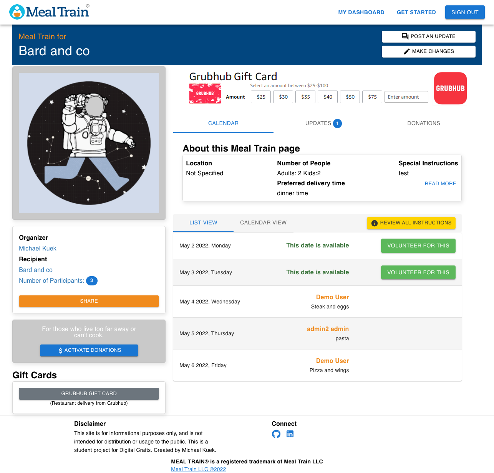
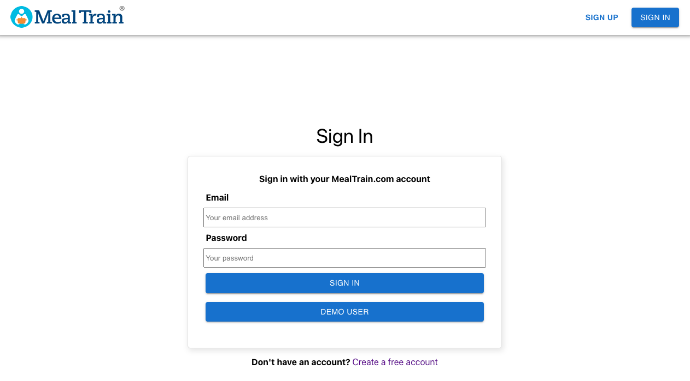
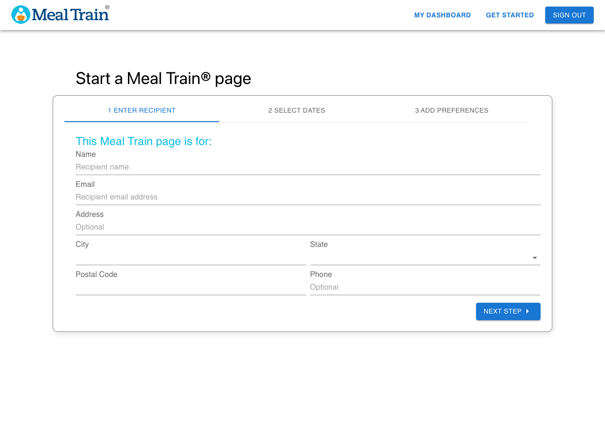
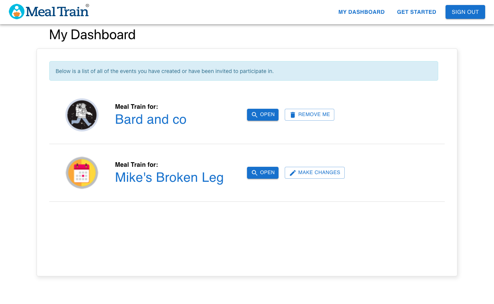
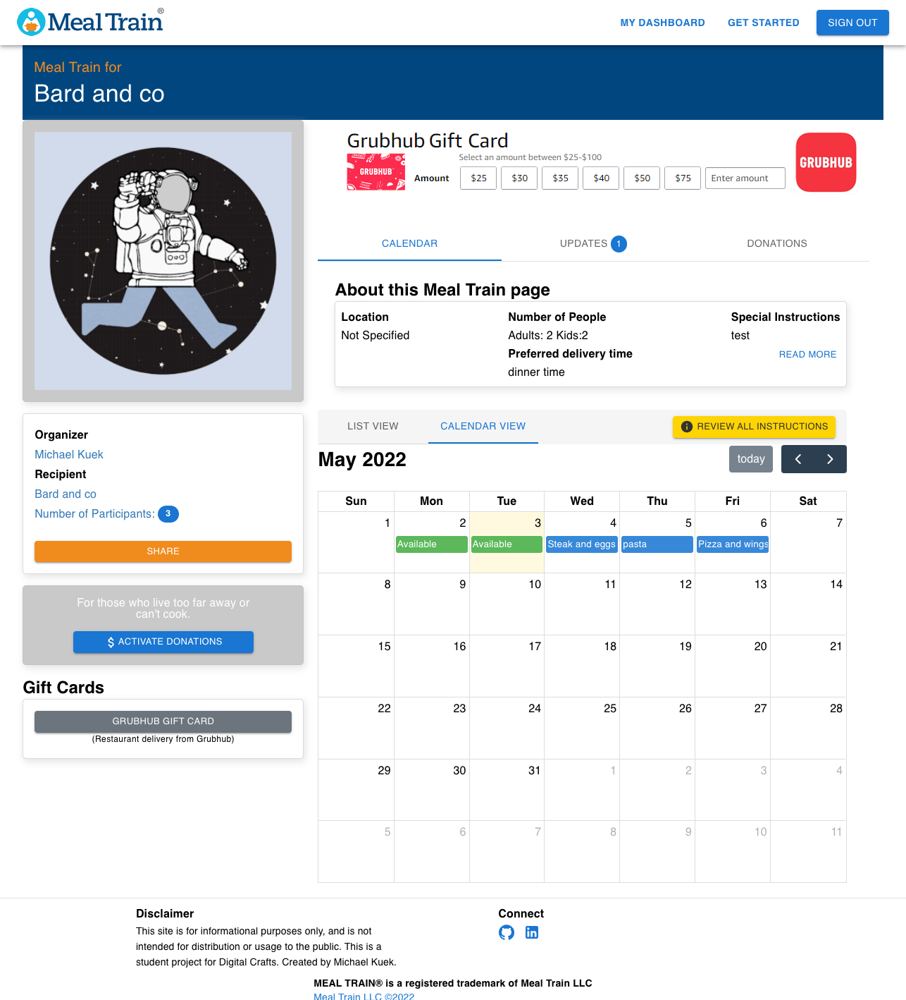
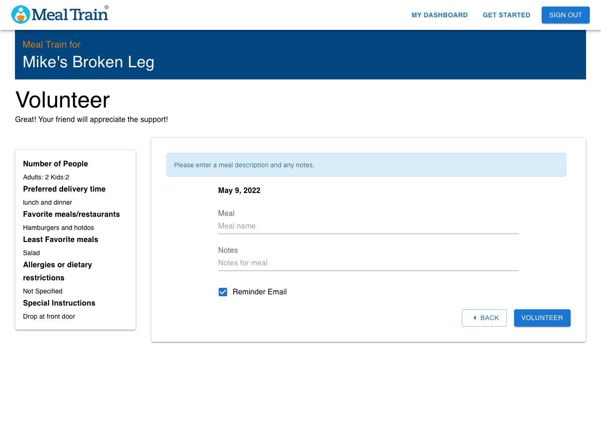
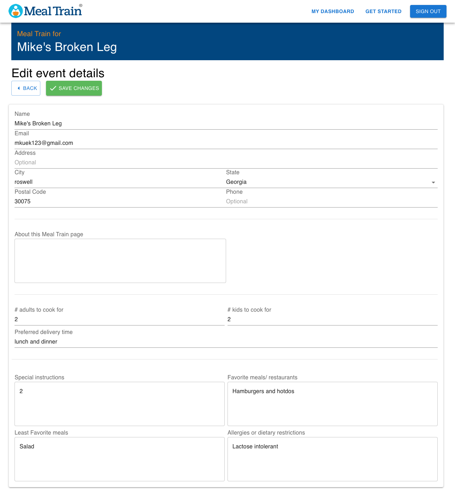
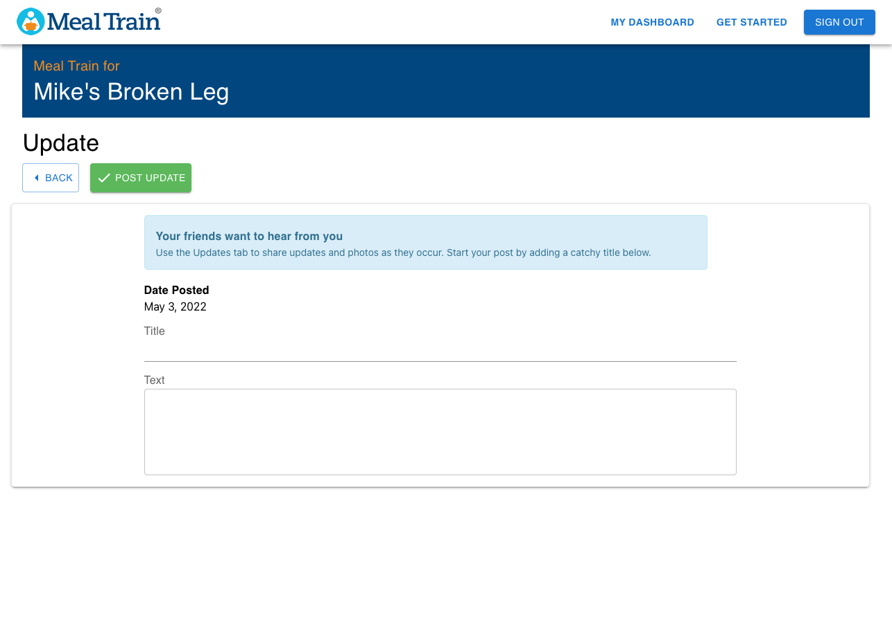
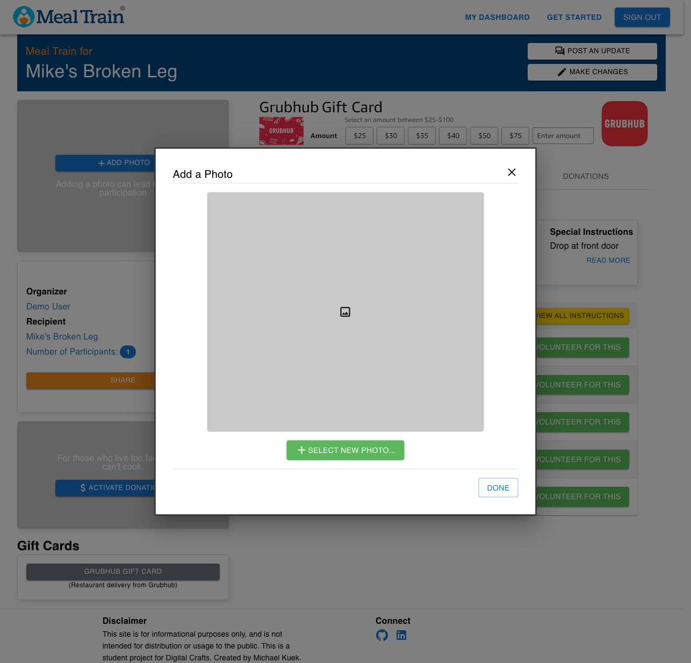
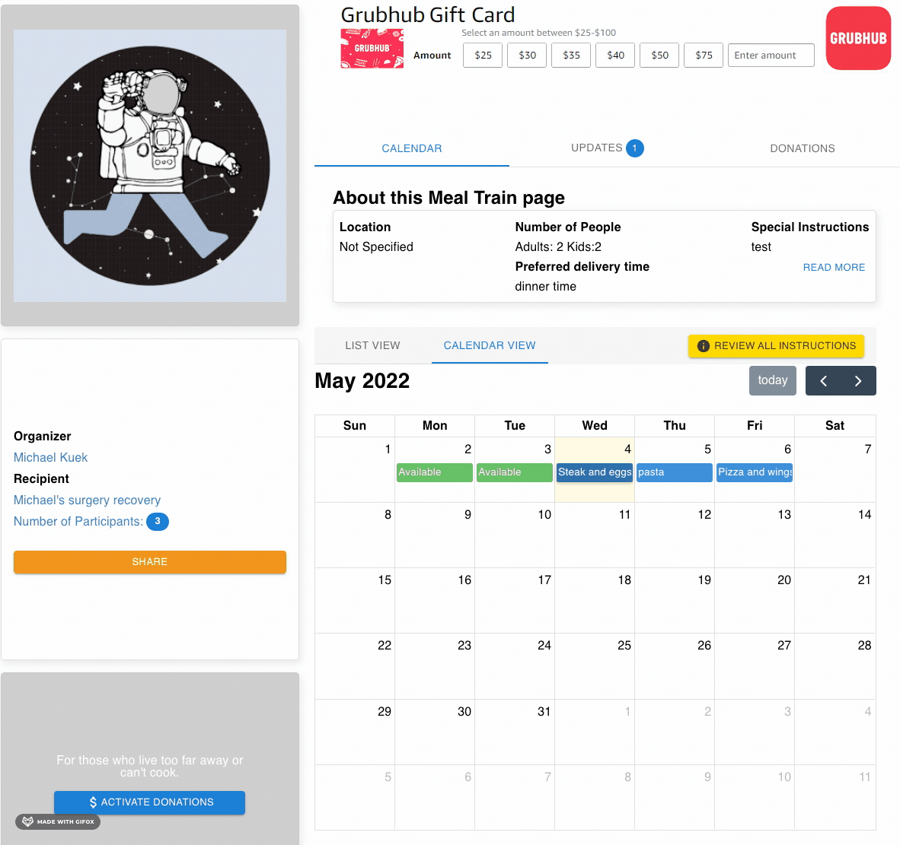

<!--
*** Thanks for checking out the Best-README-Template. If you have a suggestion
*** that would make this better, please fork the repo and create a pull request
*** or simply open an issue with the tag "enhancement".
*** Don't forget to give the project a star!
*** Thanks again! Now go create something AMAZING! :D
-->

<!-- PROJECT LOGO -->
 

  

<h3 align="center">Meals with Friends!</h3>

  

    A Clone of popular meal planning website <a href="https://mealtrain.com">MealTrain.com</a> 
     
    <a href="https://meals-with-friends.netlify.app/">View Demo</a>
  

<!-- ABOUT THE PROJECT -->

## About The Project

 
  

(<a href="#top">back to top</a>)

### Built With

- [React.js](https://reactjs.org/)
- [Material UI](https://mui.com)
- [React-Router](https://reactrouter.com)
- [Firebase](https://firebase.google.com/)
- [Sass](https://sass-lang.com/)
- [Moment](https://momentjs.com)
- [FullCalendar](https://fullcalendar.io/)
- [React-Modern-Calendar-Datepicker](https://kiarash-z.github.io/react-modern-calendar-datepicker/)

(<a href="#top">back to top</a>)

<!-- USAGE EXAMPLES -->

## Features

Meals with Friends is based upon a popular meal-planning application, MealTrain. The site allows people plan and prepare meals for friends or family in the event where they otherwise could not, such as after having a child, having major surgery, or other extended illnesses. Meals are planned for a particular date range, and users can volunteer for specific days to bring a meal. Meal information is displayed in an accessible format for all interested participants.

- #### Login/Registration handled through Firebase Authentication and Context API
 

 

- ### Meals are created via tabbed form
 

 

- ### Dashboard displays all meal trains the logged in user is participating in.
 

 

- ### Dashboard displays all meal trains the logged in user is participating in.
 

 

- ### Individual train information is displayed. Users can volunteer for a particular day usingg the calendar picker. Authenticated meal organizers are allowed to add  ps, edit the train information, and meal information.
  - ### Authenticated   
  - ### Not Authenticated  

- ### Volunteer page
 

 

  - ### Edit page
 

 

  - ### Update page
 

 

- ### A photo for the train page can be added
 

 

- ### Meal information modal can be accessed from the calendar picker
 

 

(<a href="#top">back to top</a>)

<!-- ROADMAP -->

## Roadmap

- [ ] Encrypt user passwords securely
- [ ] Form validation
- [ ] Add donation functionality
- [ ] Allow users to view all participants
- [ ] Send reminder emails
- [ ] Add messaging capabilities

See the [open issues](https://github.com/github_username/repo_name/issues) for a full list of proposed features (and known issues).

(<a href="#top">back to top</a>)

<!-- CONTRIBUTING -->

## Contributing

Contributions are what make the open source community such an amazing place to learn, inspire, and create. Any contributions you make are **greatly appreciated**.

If you have a suggestion that would make this better, please fork the repo and create a pull request. You can also simply open an issue with the tag "enhancement".
Don't forget to give the project a star! Thanks again!

1. Fork the Project
2. Create your Feature Branch (`git checkout -b feature/AmazingFeature`)
3. Commit your Changes (`git commit -m 'Add some AmazingFeature'`)
4. Push to the Branch (`git push origin feature/AmazingFeature`)
5. Open a Pull Request

(<a href="#top">back to top</a>)

<!-- LICENSE -->

## License

Distributed under the MIT License. See `LICENSE.txt` for more information.

(<a href="#top">back to top</a>)

<!-- CONTACT -->

## Contact

Michael Kuek - mkuek123@gmail.com

(<a href="#top">back to top</a>)

<!-- ACKNOWLEDGMENTS -->

## Acknowledgments

- This project was made possible by [MealTrain](https://www.mealtrain.com/)

(<a href="#top">back to top</a>)

